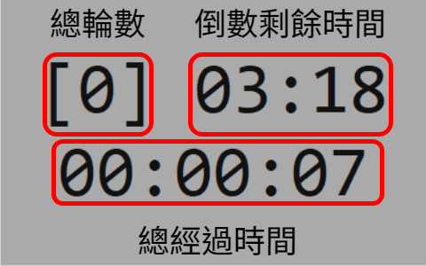

# Overlay Timer

## 簡介

這是一個可以懸浮在遊戲上方的倒數計時器，會有這個計時器的出現，是因為我在追隨[這篇文章](https://forum.gamer.com.tw/C.php?bsn=5786&snA=157238)的魔物獵人挖礦法，有個兩分半左右的礦點刷新時間，想說來寫個計時器輔助判定。

## 截圖


## 用法

到 Release 頁面下載主程式並打開即可，或者你想直接用 Python 執行程式碼。

安裝 `pynput` 套件：

```python
pip install pynput
```

啟動主程式：

```python
python main.py
```

## 說明



## 按鍵

- Home - 重置當前計時器的剩餘時間
- Insert - 重置所有時間
- Page Up - 手動增加一輪輪數
- Page Down - 手動減少一輪輪數
- End - 離開主程式

## 設定

在工作目錄底下放一個 `config.ini` 可以做一些設定：

```ini
alpha = 0.6    # 透明程度
duration = 205 # 倒數時間
font-size = 24 # 文字大小
font-name = Consolas # 文字字體
foreground = "#111"  # 文字顏色
background = "#AAA"  # 背景顏色
x-offset-scale = 0.15  # 調整視窗位置的左右距離
y-offset-scale = -0.05 # 調整視窗位置的上下距離
update-interval = 100  # 更新頻率
```

## 授權

MIT License
